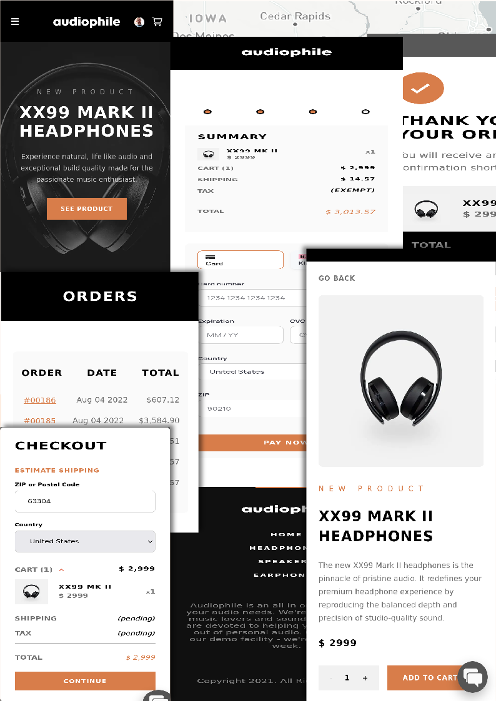

# Frontend Mentor - Audiophile e-commerce website

This is a solution to the [Audiophile e-commerce website challenge on Frontend Mentor](https://www.frontendmentor.io/challenges/audiophile-ecommerce-website-C8cuSd_wx). Frontend Mentor challenges help you improve your coding skills by building realistic projects.

## Table of contents

- [Frontend Mentor - Audiophile e-commerce website](#frontend-mentor---audiophile-ecommerce-website)
  - [Table of contents](#table-of-contents)
  - [Overview](#overview)
    - [The challenge](#the-challenge)
    - [Screenshot](#screenshot)
    - [Links](#links)
  - [My process](#my-process)
    - [Built with](#built-with)
    - [What I learned](#what-i-learned)
    - [Continued development](#continued-development)
    - [Useful resources](#useful-resources)
  - [Author](#author)
  - [Acknowledgments](#acknowledgments)

## Overview

### The challenge

Your users should be able to:

 - View the optimal layout for the app depending on their device's screen size
 - See hover states for all interactive elements on the page
 - Add/Remove products from the cart
 - Edit product quantities in the cart
 - Fill in all fields in the checkout
 - Receive form validations if fields are missed or incorrect during checkout
 - See correct checkout totals depending on the products in the cart
        Shipping always adds $50 to the order
        VAT is calculated as 20% of the product total, excluding shipping
 - See an order confirmation modal after checking out with an order summary
 - Bonus: Keep track of what's in the cart, even after refreshing the browser (localStorage could be used for this if you're not building out a full-stack app)

### Screenshot

### Links

- Solution URL: [Frontend Mentor](https://www.frontendmentor.io/)
- Live Site URL: [Audiophile](https://audiophile-tan.vercel.app/)

### My process

Before starting the project there were some things that I wanted to work on.
- create something with react framework
- incorporate a database
- have some sort of authentication process

I had just briefly read about NextJs and saw it as a great way to implement a full stack approach. Allowing me to easily incorporate the things above.

Besides react and postgres, everything was on the fly learning and reading a lot of documentation.

**Some notes...**

Most of the data is retrieved server side with database and api calls.

There are 2 different database types being used. Not sure this is good practice but I prefer postgres and wanted to implement it into the project. However, MongoDB made the most sense for the product data.

Postgres was used for authentication purposes and customer order logs. While MongoDB was used for all product data.

I added an ably chat service at the end thinking it would be like a typical customer service chat widget. like the ones you normally see on websites nowadays. I quickly realized that what I implemented was not this and more for public chat rooms. However, I have to decided to leave it in for two reasons. One, I may later create a support forum where this could be used. And two, to give people inspiration and ideas for incorporating features in their own builds 

### Built with

- Semantic HTML5 markup
- Sass CSS
- CSS Flexbox
- CSS Grid
- BEM
- React
- Next Js
- custom hooks
- localStorage
- cookies
- MongoDB
- Postgres
- [Stripe](https://stripe.com/)
- [NextAuth](https://next-auth.js.org/)
- [ShipEngine](https://www.shipengine.com/)
- [OpenWeather](https://openweathermap.org/)
- [Mapbox](https://mapbox.com/)
- [Deck.Gl](https://deck.gl/)
- [Ably](https://ably.com/)

### What I learned

Yikes. A lot.

I will have to come back later. Hard to fit within a reasonable length.

### Continued development

I wanted to follow proper development methodology and write unit tests as I build. Which I did do, ...somewhat in the beginning. However, I am still unsure of when and how to test correctly. With react testing, somethings felt trivial to test while others seemed like they would be worthwhile to test, but according to react experts, is bad practice.

I think it would be best if I worked on a smaller projects where I could spend more time mastering better testing techniques.

### Useful resources

- [stackoverflow](https://stackoverflow.com/) - Helped when I ran into some problems that I didn't understand.
- I thought most of the resources mentioned in the [Built with](#built-with) section had good documentation.

## Author

- Frontend Mentor - [@kwalker3000](https://www.frontendmentor.io/profile/kwalker3000)

## Acknowledgments

I am thankful for @gui-ni [article](https://www.jakobmaier.at/posts/next-auth-postgres-adapter/) on postgres adapter for NextAuth. And @claus for sharing a [solution](https://gist.github.com/claus/992a5596d6532ac91b24abe24e10ae81#file-usescrollrestoration-js) to solve a navigation problem I was having with Nextjs and the browser
